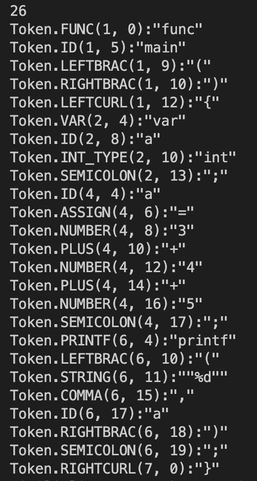
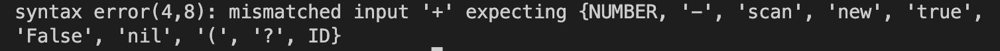

# Full description
This project I built an optimizing compiler for a subset of the Go language that called Golite, which has very similar syntax and semantics to Go. 
In Golite_Compiler Xihao wang.pdf.

## Golite Grammar

The following CFG grammar partially describes the Golite syntax. In the EBNF below, non-terminals are highlighted in blue with a `=` instead of an `->` as shown in class. You’ll notice a series of semi-colons lined up at the end of each line in the EBNF. Please ignore those semi-colons because they are needed to signal the end of a production. The language does contain semicolons to signal the end of a statement but those are terminals and are indicated as `';'`. The terminals are highlighted in green with single quotes. Don’t be frighten by the length of the grammar. We are just being very explicit about everything but the language is relatively small in comparison to the full Go language. Additional notation is provided in the below chart.

| Usage      | Month | Meaning |
| ----------- | ----------- | ----------- |
| Definition      | `=`      |   The definition of a production          |
| Repetition   | `{...}`        |   Zero or more occurrences of the symbol(s) defined in the braces.          |
| Optimal   | `[...]`        |   The symbol(s) defined in subscript brackets are not required to appear.          |
| Grouping   | `(...)`        |   Any terminal symbol from within this group is valid.          |

```
Program = Types Declarations Functions 'eof'                                                       ;
Types = {TypeDeclaration}                                                                          ;
TypeDeclaration = 'type' 'id' 'struct' '{' Fields '}' ';'                                          ;
Fields = Decl ';' {Decl ';'}                                                                       ;
Decl = 'id' Type                                                                                   ;
Type = 'int' | 'bool' | '*' 'id'                                                                   ;
Declarations = {Declaration}                                                                       ;
Declaration = 'var' Ids Type ';'                                                                   ;
Ids = 'id' {',' 'id'}                                                                              ;
Functions = {Function}                                                                             ;
Function = 'func' 'id' Parameters [ReturnType] '{' Declarations Statements '}'                     ;
Parameters = '(' [ Decl {',' Decl}] ')'                                                            ;
ReturnType = type                                                                                  ;
Statements = {Statement}                                                                           ;
Statement = Block | Assignment | Print | Delete | Read | Conditional | Loop | Return  | Invocation ;
Read = 'scan' LValue ';'                                                                           ;
Block = '{' Statements '}'                                                                         ;
Delete = 'delete' Expression ';'                                                                   ;
Assignment = LValue '=' Expression ';'                                                             ;
Print = 'printf' '(' 'string' { ',' Expression} ')'  ';'                                           ;
Conditional = 'if' '(' Expression ')' Block ['else' Block]                                         ;
Loop = 'for' '(' Expression ')' Block                                                              ;
Return = 'return' [Expression] ';'                                                                 ;
Invocation = 'id' Arguments ';'                                                                    ;
Arguments = '(' [Expression {',' Expression}] ')'                                                  ;
LValue = 'id' {'.' id}                                                                             ;
Expression = BoolTerm {'||' BoolTerm}                                                              ;
BoolTerm = EqualTerm {'&&' EqualTerm}                                                              ;
EqualTerm =  RelationTerm {('=='| '!=') RelationTerm}                                              ;
RelationTerm = SimpleTerm {('>'| '<' | '<=' | '>=') SimpleTerm}                                    ;
SimpleTerm = Term {('+'| '-') Term}                                                                ;
Term = UnaryTerm {('*'| '/') UnaryTerm}                                                            ;
UnaryTerm = '!' SelectorTerm | '-' SelectorTerm | SelectorTerm                                     ;
SelectorTerm = Factor {'.' 'id'}                                                                   ;
Factor = '(' Expression ')' | 'id' [Arguments] | 'number' | 'new' 'id' | 'true' | 'false' | 'nil'  ;
```
# Milestone 4
Successfully and fully design and implement arm code. 

The representation of arm assembly under the `ir` folder, **TranslateToAssembly** function.

To run and print out the Arm code, using the following command:
```
go run golite.go -s  ../benchmarks/simple/simple.golite
```
Our implementation can pass simple tests with simple assignment and invocation.
# Milestone 3
Successfully and fully design and implement LLVM IR. 

The representation of LLVM IR under the `ir` folder.

To run and print out the LLVM IR, using the following command:
```
go run golite.go -llvm  ../benchmarks/simple/simple.golite
```
# Milestone 2
Successfully and fully design and construct the abstract syntax tree. Partially completed the Semantic Analysis.

The representation of AST under the `ast` folder, the AST generate process in `parser.go` below comment  `/******************* Implementation of the Listeners **************************/`.

To run and print out the AST, using the following command:
```
go run golite.go -ast  ../benchmarks/simple/simple.golite
```
# Milestone1
## Compile and Run

We use Golang to build the compiler. To run the compiler on the CS Linux Servers:

Step 1: Clone this repo to your CS Linux Server

Step 2: cd golite/

Step 3: Run commands like below:

- For the parser, the compiler must read in a Golite program and parse through the input source code. E.g.
```
go run golite.go ../benchmarks/simple/simple.golite
```
- Add a flag -lex to command line arguments to print out each token on a separate line for a given program. E.g.
```
go run golite.go -lex  ../benchmarks/simple/simple.golite
```

## Testing

- Lexer results: Please see the result for **../benchmarks/simple/simple.golite**.



- Parser results: Please see the result for **../benchmarks/bad/bad.golite**.



